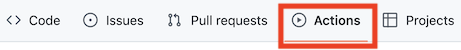
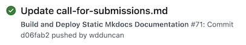
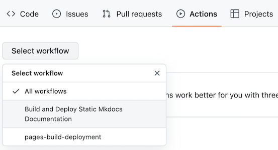
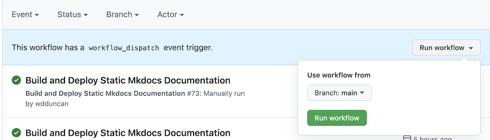
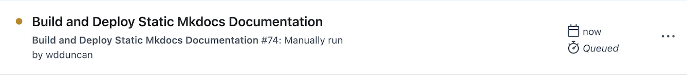
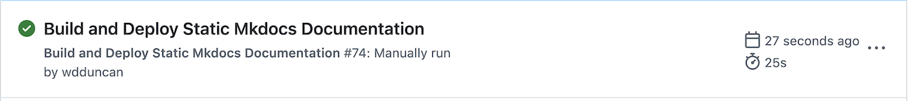

# ICBO-2024: International Conference on Biomedical Ontology

## Editing website content 

The website content is contained in the `docs/`, `docs/images/`, `docs/papers/`, `docs/slides/`, and `docs/flash-talks/` directories. Editing any of the `*.md` files or adding/changing an image **should** fire off an action to build and deploy the website. This GitHub action can be checked by navigating to the `Actions` page:



and verifying that the changes fired off an action. For example, here is an action that started as a result of an update the to the `call-for-submissions.md`:

  

After the action has finished running (it will have green check), verify that the edits are displayed on the website. 

## Adding new webpages

Adding new webpage takes two steps:

1. Create the new `md` file in the `docs/` directory.
2. Edit the `nav` section of `mkdocs.yml` to reference the new document and its title.

## Adding new images

A new image is added to the website is done by simply saving a the image to the `docs/images/` directory. However, referencing the image from the `md` file is a bit nuanced.  

If you reference the image using markdown syntax, you include the `images` directory in the path to the images. For example, in the `docs/call-for-submissions.md` document, the reference to a image is done like so:
```

```

However, if you are customizing the image with an HTML `` tag, you use the `../images` directory in the path to the image. For example, `src='../images/test-image.png'` is the path needed when setting the margins of an image like this:
```

```
The reason for this has to do with how `read the docs` processes images, but I don't know the details of why.

## Manually deploying the website 

If (for some reason) the GitHub action does not fire, you can manually run it. First, on the `Actions` page, select the `Build and Deploy Static Mkdocs Documentation` workflow.  





Next, click on the `Run workflow` button.  


  


Once the workflow starts running, you will see yellow dot beside the workflow name.  




After the workflow, completes you will see a green check beside the workflow name.





Verify that the edits are displayed on the website. 

